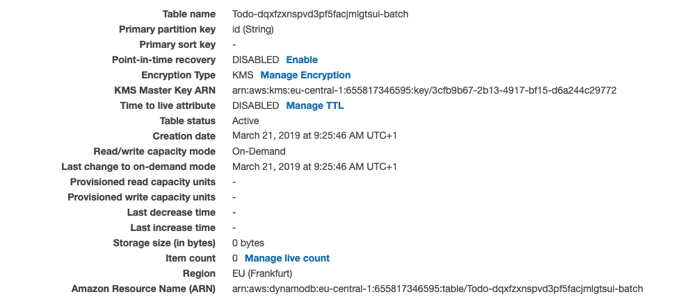

In this article, you are going to learn **how to create bulk queries and mutations** that require authentication in Cognito for an AWS Amplify project using the AppSync API.

---

**Note:** This post is an advanced tutorial. Do you want to learn how to accelerate the creation of your projects using Amplify 🚀? I recommend checking out [Nader Dabit](https://twitter.com/dabit3)'s [free course on egghead](https://egghead.io/courses/building-serverless-web-applications-with-react-aws-amplify) to learn the basics. Amplify's ['Getting Started'](https://aws-amplify.github.io/docs/js/start) is also pretty good.

**Another Note:** Huge thank you to [Mike](https://twitter.com/mikeparisstuff) for helping me debugging when I first set this up 🙏🏻.

---

While building my projects using AWS Amplify, I quickly found myself having to batch create objects. My first instinct was to use `Promise.all`.

```js
import API, { graphqlOperation } from '@aws-amplify/api';
import * as R from 'ramda';

import * as queries from './graphql/queries';

// For the tutorial's sake we are creating the data here by using fixtures.
const todos = [
  { id: 1, title: 'Get groceries', description: '', completed: false },
  // Never skip leg day 🦵🏻
  {
    id: 2,
    title: 'Go to the gym',
    description: 'Leg Day',
    completed: true,
  },
];

const createTodo = input =>
  API.graphql(graphqlOperation(queries.createTodo, { input }));
// Careful, R.isEmpty is also true for [], {}, etc.
// You could also write x => x === '' to only catch empty strings.
const replaceEmptyStringWithNull = R.map(
  R.ifElse(R.isEmpty, R.always(null), R.identity)
);

// Map over the todos, to remove the id, replace the empty strings with
// null - so that DynamoDB doesn't yell at us - and execute the mutation.
await Promise.all(
  R.map(
    R.pipe(
      R.dissoc('id'),
      replaceEmptyStringWithNull,
      createTodo
    )
  )(todos)
);
```

As you can probably tell, `Promise.all` can lead to race conditions and other problems. What happens if one of the requests throws, but the others come through? 🤔

It turns out **[since February](https://aws.amazon.com/blogs/mobile/amplify-adds-support-for-multiple-environments-custom-resolvers-larger-data-models-and-iam-roles-including-mfa/) you can write custom resolvers in AWS Amplify**, which enables you to write your own batch actions for the AppSync API. If you aren't familiar with writing resolvers: _I'm neither_. You will get a sufficient basic feeling for them once you read their code further below. In Germany, there is a saying "A good horse only jumps as high as it has to."

We are going to **write a custom resolver for batch creations** with authentication. Having learned that, you should be able to do batch queries and updates on your own (e.g. leaving out authentication is strictly less code). If you have any questions, you can always hit me up on Twitter via [@janhesters](https://twitter.com/janhesters). (You might want to say "Hi" regardless.)

Let's code up an example using React 👏🏻!

## Set Up the Example Project

Create a new React app.

```bash
npx create-react-app amplify-batch-example && cd amplify-batch-example
```

Add Amplify:

```bash
yarn add aws-amplify aws-amplify-react
```

Next, initialize Amplify. Add `auth` and `api` (`amplify add <category>`). While going through the prompts for `api`, choose `Amazon Cognito User Pool` authentication, choose `Single object with fields` and edit the schema like this:

```graphql
type Todo @model @auth(rules: [{ allow: owner }]) {
  id: ID!
  title: String!
  description: String
  completed: Boolean
}
```

Otherwise, go with the defaults for both services. (Remember to run `amplify push`.)

Lastly, configure Amplify, so that you can wrap the default export in `App.js` with the [`withAuthenticator` HOC](https://aws-amplify.github.io/docs/js/authentication#using-withauthenticator-hoc). (Again, if you are still reading and don't understand what you are being asked to do here, check out the materials I linked at the beginning. Remember to come back later to read this article. It's not going away.)

## Creating the Batch Mutation

The project is set up, and we are ready to create the batch mutation. First, we need to write a simple mutation in `schema.graphql`.

```graphql
// ... Todo above

input CreateTodoInput {
  id: ID
  title: String!
  description: String
  completed: Boolean
}

type Mutation {
  batchAddTodos(todos: [CreateTodoInput]): [Todo]
}
```

**Note:** You need to run `amplify add api` without the `batchAddTodos` mutation first and then add it via `amplify add update`.

_Tip:_ You can copy `CreateTodoInput` straight from the `builds/schema.graphql` folder 😉.¹

Before we create the custom resolver templates, **we need to tell CloudFormation where it can find these custom resources.** We can do this by adding a value for the `"Resources"` in `amplify/api/<your-api-name>/stacks/CustomResources.json`.

```json
// Leave the rest as it is.
 "Resources": {
    "EmptyResource": {
      "Type": "Custom::EmptyResource",
      "Condition": "AlwaysFalse"
    },
    "BatchAddTodosResolver": {
      "Type": "AWS::AppSync::Resolver",
      "Properties": {
        "ApiId": {
          "Ref": "AppSyncApiId"
        },
        "DataSourceName": "TodoTable",
        "TypeName": "Mutation",
        "FieldName": "batchAddTodos",
        "RequestMappingTemplateS3Location": {
          "Fn::Sub": [
            "s3://${S3DeploymentBucket}/${S3DeploymentRootKey}/resolvers/Mutation.batchAddTodos.req.vtl",
            {
              "S3DeploymentBucket": {
                "Ref": "S3DeploymentBucket"
              },
              "S3DeploymentRootKey": {
                "Ref": "S3DeploymentRootKey"
              }
            }
          ]
        },
        "ResponseMappingTemplateS3Location": {
          "Fn::Sub": [
            "s3://${S3DeploymentBucket}/${S3DeploymentRootKey}/resolvers/Mutation.batchAddTodos.res.vtl",
            {
              "S3DeploymentBucket": {
                "Ref": "S3DeploymentBucket"
              },
              "S3DeploymentRootKey": {
                "Ref": "S3DeploymentRootKey"
              }
            }
          ]
        }
      }
    }
  },
// ... more code
```

We provided CloudFormation with the file paths and the name & type of the mutation for the resolvers. Let's write them now. We will start with the resolver for requests. Create a file `amplify/api/<your-api-name>/resolvers/Mutation.batchAddTodos.req.vtl`.²

```velocity
#foreach($item in ${ctx.args.todos})
    ## [Start] Owner Authorization Checks **
    #set( $isOwnerAuthorized = false )
    ## Authorization rule: { allow: "owner", ownerField: "owner", identityField: "cognito:username" } **
    #set( $allowedOwners0 = $util.defaultIfNull($item.owner, null) )
    #set( $identityValue = $util.defaultIfNull($ctx.identity.claims.get("username"),
    $util.defaultIfNull($ctx.identity.claims.get("cognito:username"), "___xamznone____")) )
    #if( $util.isList($allowedOwners0) )
        #foreach( $allowedOwner in $allowedOwners0 )
            #if( $allowedOwner == $identityValue )
                #set( $isOwnerAuthorized = true )
            #end
        #end
    #end
    #if( $util.isString($allowedOwners0) )
        #if( $allowedOwners0 == $identityValue )
            #set( $isOwnerAuthorized = true )
        #end
    #end
    #if( $util.isNull($allowedOwners0) && (! $item.containsKey("owner")) )
        $util.qr($item.put("owner", $identityValue))
        #set( $isOwnerAuthorized = true )
    #end
    ## [End] Owner Authorization Checks **

    ## [Start] Throw if unauthorized **
    #if( !($isStaticGroupAuthorized == true || $isDynamicGroupAuthorized == true || $isOwnerAuthorized
        == true) )
        $util.unauthorized()
    #end
    ## [End] Throw if unauthorized **
#end

#set($todosdata = [])
#foreach($item in ${ctx.args.todos})
    $util.qr($item.put("createdAt", $util.time.nowISO8601()))
    $util.qr($item.put("updatedAt", $util.time.nowISO8601()))
    $util.qr($item.put("__typename", "Todo"))
    $util.qr($item.put("id", $util.defaultIfNullOrBlank($item.id, $util.autoId())))
    $util.qr($todosdata.add($util.dynamodb.toMapValues($item)))
#end
{
  "version": "2018-05-29",
  "operation": "BatchPutItem",
  "tables": {
      "Todo-dqxfzxnspvd3pf5facjmlgtsui-batch": $utils.toJson($todosdata)
  }
}
```

And create a file for the response in `amplify/api/<your-api-name>/resolvers/Mutation.batchAddTodos.res.vtl`.

```velocity
#if ($ctx.error)
    $util.appendError($ctx.error.message, $ctx.error.type, null, $ctx.result.data.unprocessedKeys)
#end

$util.toJson($ctx.result.data.Todo-dqxfzxnspvd3pf5facjmlgtsui-batch)
```

Okay, hold on, what's going on here?³ 🤔

We start by looping through all items in the request, checking them for permission and throw if a permission is denied. You can compare this file to `amplify/api/<your-api-name>/build/resolvers/Mutation.createTodo.res.vtl` and see that the code generated by the API does this too, but just for a single todo. Subsequently, we loop through all items again. In this loop, we add fields for `createdAt`, `updatedAt` and `__typename`. We also add an auto-generated id. These additions are there to keep the data consistent with the data that gets created by the resolvers that result from the Amplify API. We then push the processed items into a `todosdata` array. Finally, we make a `BatchPutItem` operation, adding the data to the correct table. Note that to support `BatchPutItem` the `"version"` number is higher than the one in the `createTodo` resolver. Additionally, make sure you use the correct name of your table. You can find it in you AWS console when you search for DynamoDB.



In the response, we have to handle errors for the items whose operations failed. We pass the unprocessed keys back to the caller via the `errorInfo` field. Afterwards, we return the response as JSON. The response will look like this:

```json
{
  "data": {
    "batchAddTodos": {
      // ... processed todos data
    }
  },
  "errors": [
    {
      "path": ["batchAddTodos"],
      "data": null,
      "errorType": "DynamoDB:ProvisionedThroughputExceededException",
      "errorInfo": {
        "todos": [
          {
            "sensorId": "1",
            "timestamp": "2019-03-20T17:21:05.000+02:00"
          }
        ]
      },
      "locations": [
        {
          "line": 61,
          "column": 2
        }
      ],
      "message": "You exceeded your maximum allowed provisioned throughput for a table or for one or more global secondary indexes. (...)"
    }
    // more unprocessed todos with their respective error message
  ]
}
```

As you can see **we neatly separated the processed from the unprocessed todos in our response.** This request is atomic, so there are no race conditions ⛔️🏎.

## Using the Batch Mutation

After running `amplify push` again, let's use the new mutation in our app.

```jsx
import './App.css';

import API, { graphqlOperation } from '@aws-amplify/api';
import { withAuthenticator } from 'aws-amplify-react';
import React, { useEffect, useState } from 'react';

import { listTodos } from './graphql/queries';
import { batchAddTodos } from './graphql/mutations';

// If you don't like Ramda 🐏
const map = f => arr => arr.map(f);
const pipe = (...fns) => x => fns.reduce((y, f) => f(y), x);
const dissoc = prop => ({ [prop]: _, ...obj }) => obj;
const mapObj = f => obj =>
  Object.keys(obj).reduce(
    (acc, key) => ({ ...acc, [key]: f(obj[key]) }),
    {}
  );
const replaceEmptyStringWithNull = x => (x === '' ? null : x);
const prepareTodos = map(
  pipe(
    dissoc('id'),
    mapObj(replaceEmptyStringWithNull)
  )
);

const todoFixtures = [
  { id: 1, title: 'Get groceries', description: '', completed: false },
  {
    id: 2,
    title: 'Go to the gym',
    description: 'Leg Day',
    completed: true,
  },
];

function App() {
  const [todos, setTodos] = useState([]);

  useEffect(() => {
    async function fetchTodos() {
      try {
        const todoData = await API.graphql(graphqlOperation(listTodos));
        setTodos(todoData.data.listTodos.items);
      } catch (err) {
        console.log('error: ', err);
      }
    }

    fetchTodos();
  }, []);

  async function handleClick() {
    try {
      const input = { todos: prepareTodos(todoFixtures) };
      const res = await API.graphql(
        graphqlOperation(batchAddTodos, input)
      );
      setTodos([...todos, ...res.data.batchAddTodos]);
    } catch (err) {
      console.log('error ', err);
    }
  }

  const renderTodo = ({ id, title, description, completed }) => (
    <div key={id}>
      <h3>{`${title} ${completed ? '✅' : ''}`}</h3>
      <p>{description}</p>
    </div>
  );

  const renderTodos = map(renderTodo)(todos);

  return (
    <div className="App">
      <div>{renderTodos}</div>
      <div>
        <button onClick={handleClick}>Batch Add</button>
      </div>
    </div>
  );
}

export default withAuthenticator(App, { includeGreetings: true });
```

It works 👌🏻. _Remember:_ You can clean up the resources and delete everything by running `amplify delete`.

## Summary and Closing Comments

We wrote custom resolvers to add batch create items. We eliminated race conditions and instead get back both, the processed items and the unprocessed items along with their respective error message. Keep in mind that [`BatchPutItem`](https://docs.aws.amazon.com/appsync/latest/devguide/resolver-mapping-template-reference-dynamodb.html#aws-appsync-resolver-mapping-template-reference-dynamodb-batch-put-item) is limited to 25 items.

I think Amplify is an excellent tool that lets you **realize your ideas quickly.** It's unfortunate that the CLI can't generate the code for some everyday tasks like these batch requests, yet. I can't wait until it can! Until then we have to take care of these things manually 🎓.

## Helpful Resources

If you want to dig deeper, I can recommend the following resources:

1. The [AWS Amplify docs for custom resolvers](https://aws-amplify.github.io/docs/cli/graphql#add-a-custom-resolver-that-targets-a-dynamodb-table-from-model). These will teach you how to write resolvers in general.
2. The ['AWS AppSync Tutorial: DynamoDB Batch Resolvers'](https://docs.aws.amazon.com/appsync/latest/devguide/tutorial-dynamodb-batch.html#permissions). It shows how to make batch creations using AWS AppSync.
3. The [AWS AppSync docs for the resolver mapping template](https://docs.aws.amazon.com/appsync/latest/devguide/resolver-mapping-template-reference-dynamodb.html) which explains what the keys in the `.vtl` files like `"operation"` and `"key"` do.
4. The [AWS AppSync Docs for the \$util reference](https://docs.aws.amazon.com/appsync/latest/devguide/resolver-util-reference.html) which explains the methods used by `$util`.

You can spend hours reading and studying these links, but they will equip you with the knowledge to tackle a variety of problems.

## Footnotes

1. You [soon](https://github.com/aws-amplify/amplify-cli/issues/1009) might have these inputs in your schema, too! 🎉
2. `.vtl` stands for ["Velocity Template Language"](http://velocity.apache.org/engine/1.7/user-guide.html). There is [a neat VSCode extension](https://marketplace.visualstudio.com/items?itemName=luqimin.velocity) for Velocity you want code highlighting for this language. [Here](https://docs.aws.amazon.com/appsync/latest/devguide/resolver-mapping-template-reference-programming-guide.html#aws-appsync-resolver-mapping-template-reference-programming-guide) is how it relates to the data sources for AWS AppSync.
3. Pro tip: You can "`console.log`" by using `$util.appendError($util.toJson($ctx.result.data))` in the resolvers.

## Bonus

Here is a little code snippet showing `asyncForEach`. This function in conjunction with `splitEvery(25)` from Ramda can help you chunking your requests if you want to add more than 25 items. You can split the items in chunks of 25 and then call the mutation for each chunk using `asyncForEach`.

```js
const waitFor = ms => new Promise(r => setTimeout(r, ms));
const asyncForEach = async (array, callback) => {
  for (let index = 0; index < array.length; index++) {
    await callback(array[index], index, array);
  }
};

const start = async () => {
  await asyncForEach([1, 2, 3], async num => {
    await waitFor(3000);
    console.log(num);
  });
  console.log('Done');
};

start();
```
