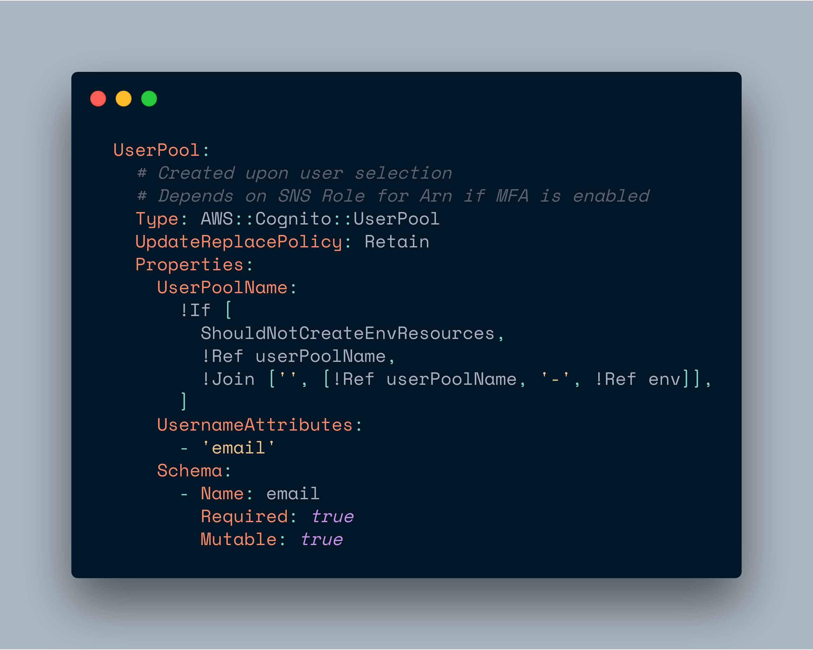

In this post **you are going to learn how to add email authentication to your Amplify app** without requiring an username.

---

**Note:** This article assumes a basic understanding of AWS Amplify. Check out [this great course](https://egghead.io/courses/building-serverless-web-applications-with-react-aws-amplify) by [Nader Dabit](https://twitter.com/dabit3) if you want to learn the basics.

---

I recently started using the AWS Amplify CLI. The default authentication when using AWS Amplify is username, email and phone number. I didn't want to use a username. After googling and [filing an issue](https://github.com/aws-amplify/amplify-js/issues/2860) I found out that this feature is currently _**not**_ supported. Bummer 🙄

But, there is a way to do it semi-manually! 👏🏻

It requires one step (two if you are using React and want to use Amplify's UI components).

## Configure the Auth Settings

Run `amplify add auth`.¹ Next, in your generated `<weird-number>-cloudformation-template.yml` in the directory `amplify/backend/auth/<weird-number>/` add the following code:



**This will configure the Cognito user pool to use the email as the username attribute.**

For a full list of possible values you can find the [AWS Cognito docs here](https://docs.aws.amazon.com/AWSCloudFormation/latest/UserGuide/aws-resource-cognito-userpool.html).

## (Optional) Configure the UI Components

If you are using the `withAuthenticator` HOC, add the following code:

```js
const signUpConfig = {
  hiddenDefaults: ['username'],
  signUpFields: [
    {
      label: 'Email',
      key: 'username', // ❗️❗️❗️
      required: true,
      displayOrder: 1,
      type: 'string',
      custom: false,
    },
    {
      label: 'Password',
      key: 'password',
      required: true,
      displayOrder: 2,
      type: 'password',
      custom: false,
    },
    {
      label: 'Phone Number',
      key: 'phone_number',
      required: true,
      displayOrder: 3,
      type: 'tel',
      custom: false,
    },
  ],
};

export default withAuthenticator(App, { signUpConfig });
```

**This will tell Amplify to omit the `username` field and render an `email` field instead.** Check out [the docs](https://aws-amplify.github.io/docs/js/react#signup-configuration) for more info - for example if you want to use the `<Authenticator />` component with custom components.

Unfortunately, the sign in component still displays the username and an `<input type="name"/>` instead of `type="email"`. But it will correctly sign up using the email. This could confuse users. The only way to fix this is by using a custom component.

## Footnotes

1. I did this with a brand new project. I don't know if it works with an existing user-pool. You could try modifying your existing `.yml` file and running `amplify update auth` and `amplify push`. Otherwise you will have to delete it (and loose all existing users at your awn risk) by using `amplify remove auth` and `amplify push`) 🤷🏻‍♂️
