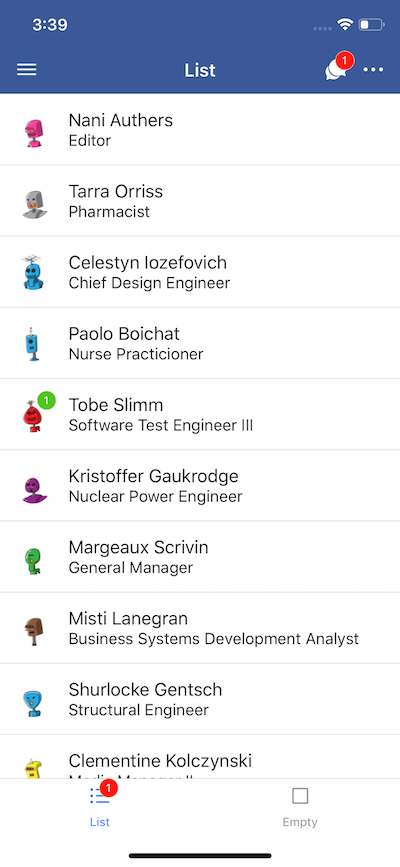

In this article, you are going to learn how to **add badges to components in React Native** for both iOS and Android in your app. You’ll see an easy example of **using Higher-Order Components.**

---

Badges are a core feature in both Android and iOS apps. I find myself frequently having to add badges to my UI. But I didn’t discover any library that streamlined adding badges to its components¹.

We are going to change that. You are going to learn how to create a simple [Higher-Order Component](https://reactjs.org/docs/higher-order-components.html) (HOC) that makes adding badges to components super easy. We are going to be adding badges to list items as well as icons.

Here is a preview of what we are going to build. (Scroll to the bottom of the post to see the full app.)


This tutorial has two parts. In the first part, we are going to create a simple dummy app, so I can show you how to use the HOC in different situations. We will write the HOC in the second part. **If you only want to see the code for the HOC, skip to section 2.**

## 1. Building the App

Start by creating a new React Native app.

```bash
react-native init badgeapp && cd badgeapp
```

We will use three packages. React Navigation, React Native Elements and React Native Vector Icons, so we can quickly build a UI. Install and link them.

Note: As of the publishing of this post, React Navigation V3 has been released. The instructions in this tutorial are written with V2. Furthermore, React Native Elements is still in beta and will release its version 1.0.0 soon. Therefore we are going to use the “next” branch.

```bash
npm install --save react-navigation@2.18.2 https://github.com/react-native-training/react-native-elements.git\#next react-native-vector-icons && react-native link
```

In your project folder create a folder called `app/` (adjacent to your `node_modules/`). Move the `App.js` file to this folder and modify `index.js` to import App from the new location.

```js
import App from './app/App';
```

Within `app/` create four more folders: `components/`, `config/`, `navigation/` and `screens/`. (Make sure to create the file for the HOC part, too, in `components/`.)

Within `config/` create a file called `fixtures.js` and post the following array into it.

```js
export const data = [
  {
    id: 1,
    firstName: 'Nani',
    lastName: 'Authers',
    job: 'Editor',
    avatar:
      'https://robohash.org/doloremqueestquos.png?size=50x50&set=set1',
  },
  {
    id: 2,
    firstName: 'Tarra',
    lastName: 'Orriss',
    job: 'Pharmacist',
    avatar:
      'https://robohash.org/voluptasutmodi.png?size=50x50&set=set1',
  },
  {
    id: 3,
    firstName: 'Celestyn',
    lastName: 'Iozefovich',
    job: 'Chief Design Engineer',
    avatar:
      'https://robohash.org/sitofficiisporro.png?size=50x50&set=set1',
  },
  {
    id: 4,
    firstName: 'Paolo',
    lastName: 'Boichat',
    job: 'Nurse Practicioner',
    avatar:
      'https://robohash.org/reprehenderiteteos.png?size=50x50&set=set1',
  },
  {
    id: 5,
    firstName: 'Tobe',
    lastName: 'Slimm',
    job: 'Software Test Engineer III',
    avatar:
      'https://robohash.org/officiisanimidignissimos.png?size=50x50&set=set1',
  },
  {
    id: 6,
    firstName: 'Kristoffer',
    lastName: 'Gaukrodge',
    job: 'Nuclear Power Engineer',
    avatar:
      'https://robohash.org/laboriosamvoluptatibusneque.png?size=50x50&set=set1',
  },
  {
    id: 7,
    firstName: 'Margeaux',
    lastName: 'Scrivin',
    job: 'General Manager',
    avatar: 'https://robohash.org/utnonhic.png?size=50x50&set=set1',
  },
  {
    id: 8,
    firstName: 'Misti',
    lastName: 'Lanegran',
    job: 'Business Systems Development Analyst',
    avatar: 'https://robohash.org/velquised.png?size=50x50&set=set1',
  },
  {
    id: 9,
    firstName: 'Gandalf',
    lastName: 'Dumbledore',
    job: 'Wizard',
    avatar:
      'https://robohash.org/iurearchitectoquisquam.png?size=50x50&set=set1',
  },
  {
    id: 10,
    firstName: 'Clementine',
    lastName: 'Kolczynski',
    job: 'Media Manager II',
    avatar:
      'https://robohash.org/atdolorimpedit.png?size=50x50&set=set1',
  },
  {
    id: 11,
    firstName: 'Andrey',
    lastName: 'Twallin',
    job: 'Environmental Specialist',
    avatar: 'https://robohash.org/velitquised.png?size=50x50&set=set1',
  },
  {
    id: 12,
    firstName: 'Shirleen',
    lastName: 'Krebs',
    job: 'Cost Accountant',
    avatar:
      'https://robohash.org/nisiimpeditvel.png?size=50x50&set=set1',
  },
  {
    id: 13,
    firstName: 'Arvie',
    lastName: 'Fitchell',
    job: 'Health Coach I',
    avatar:
      'https://robohash.org/voluptatemvoluptatemmaxime.png?size=50x50&set=set1',
  },
  {
    id: 14,
    firstName: 'Staford',
    lastName: 'Thorley',
    job: 'Senior Editor',
    avatar:
      'https://robohash.org/doloremexcepturivoluptate.png?size=50x50&set=set1',
  },
  {
    id: 15,
    firstName: 'Mord',
    lastName: 'Ringwood',
    job: 'Marketing Manager',
    avatar: 'https://robohash.org/fugitautomnis.png?size=50x50&set=set1',
  },
];
```

We will use this data to display our dummy list. We are going for a basic two tabs layout. Create two files, one for each screen, within `screens/` (`EmptyScreen.js` and `ListScreen.js`). The first one will be empty and is just there to make our tabs look good².

```jsx
import React, { Component } from 'react';
import { StatusBar, StyleSheet, Text } from 'react-native';
import { SafeAreaView } from 'react-navigation';

const styles = StyleSheet.create({
  container: {
    flex: 1,
    justifyContent: 'center',
    alignItems: 'center',
  },
});

export class EmptyScreen extends Component {
  static navigationOptions = {
    headerTitle: 'Empty',
  };
  render() {
    return (
      <SafeAreaView style={styles.container}>
        <StatusBar backgroundColor="#3b5998" barStyle="light-content" />
        <Text>This screen is empty.</Text>
      </SafeAreaView>
    );
  }
}

export default EmptyScreen;
```

The second screen contains the list with our dummy items.

```jsx
import React, { Component } from 'react';
import { FlatList, Platform, StatusBar, StyleSheet } from 'react-native';
import { SafeAreaView } from 'react-navigation';
import { data } from '../config/fixtures';
import { ListItem, Icon } from 'react-native-elements';

const styles = StyleSheet.create({
  container: {
    flex: 1,
  },
  padLeft: {
    paddingLeft: 16,
  },
  padRight: {
    paddingRight: 16,
  },
});

export class ListScreen extends Component {
  static navigationOptions = {
    headerLeft: (
      <Icon
        name={`${Platform.OS === 'ios' ? 'ios' : 'md'}-menu`}
        type="ionicon"
        color="white"
        containerStyle={styles.padLeft}
      />
    ),
    headerTitle: 'List',
    headerRight: (
      <React.Fragment>
        <Icon
          name={`${Platform.OS === 'ios' ? 'ios' : 'md'}-chatbubbles`}
          type="ionicon"
          color="white"
          containerStyle={styles.padRight}
        />
        <Icon
          name={`${Platform.OS === 'ios' ? 'ios' : 'md'}-more`}
          type="ionicon"
          color="white"
          containerStyle={styles.padRight}
        />
      </React.Fragment>
    ),
  };

  keyExtractor = item => String(item.id);

  renderItem = ({ item }) => (
    <ListItem
      title={`${item.firstName} ${item.lastName}`}
      subtitle={item.job}
      leftAvatar={{ source: { uri: item.avatar } }}
      bottomDivider={true}
    />
  );

  render() {
    return (
      <SafeAreaView style={styles.container}>
        <StatusBar backgroundColor="#3b5998" barStyle="light-content" />
        <FlatList
          data={data}
          keyExtractor={this.keyExtractor}
          renderItem={this.renderItem}
        />
      </SafeAreaView>
    );
  }
}

export default ListScreen;
```

We use a simple `<FlatList />` here that renders through the data array. Additionally, we add a couple of `<Icon />`s to the header so that we can badge them up later.

Next, create the navigation routes inside `navigation/navigation.js`.

```jsx
import React from 'react';
import { Platform } from 'react-native';
import {
  createBottomTabNavigator,
  createStackNavigator,
} from 'react-navigation';
import EmptyScreen from '../screens/EmptyScreen';
import ListScreen from '../screens/ListScreen';
import { Icon } from 'react-native-elements';

const stackConfig = {
  cardStyle: { backgroundColor: 'white' },
  navigationOptions: {
    headerStyle: { backgroundColor: '#3b5998' },
    headerTintColor: 'white',
  },
};

const ListStack = createStackNavigator(
  { ListScreen },
  { ...stackConfig }
);
ListStack.navigationOptions = {
  tabBarLabel: 'List',
  tabBarIcon: ({ tintColor }) => (
    <Icon
      name={`${Platform.OS === 'ios' ? 'ios' : 'md'}-list`}
      type="ionicon"
      color={tintColor}
    />
  ),
};

const EmptyStack = createStackNavigator(
  { EmptyScreen },
  { ...stackConfig }
);
EmptyStack.navigationOptions = {
  tabBarLabel: 'Empty',
  tabBarIcon: ({ tintColor }) => (
    <Icon
      name={`${Platform.OS === 'ios' ? 'ios' : 'md'}-square-outline`}
      type="ionicon"
      color={tintColor}
    />
  ),
};

const RootTabs = createBottomTabNavigator({ ListStack, EmptyStack });

export default RootTabs;
```

Nothing special is going on here. I like to configure my navigators using constants like stackConfig. If your app grows large, it spares you a lot of spaghetti code and lets you change the look of your app in one place.

Lastly, we need to hook up our navigator to the app.

```jsx
import React, { Component } from 'react';
import Navigator from './navigation/navigation';

export default class App extends Component {
  render() {
    return <Navigator />;
  }
}
```

Well done. We are now ready to build the HOC 🙌🏻.

## 2. a.) Coding the Higher-Order Component

Why do we build a HOC? [According to the documentation](https://reactjs.org/docs/higher-order-components.html), “a higher-order component is a function that takes a component and returns a new component”. Consequently, the reason we use a HOC is its flexibility and reusability. Instead of overwriting all components to give them a `badge` prop, we can wrap it in our HOC.

Create a file within `components/` called `withBadge.js`.

```jsx
import React from 'react';
import { StyleSheet, View } from 'react-native';
import { Badge } from 'react-native-elements';

const styles = StyleSheet.create({
  badge: {
    borderRadius: 9,
    height: 18,
    minWidth: 0,
    width: 18,
  },
  badgeContainer: {
    position: 'absolute',
  },
  badgeText: {
    fontSize: 10,
    paddingHorizontal: 0,
  },
});

const withBadge = (value, options = {}) => WrappedComponent =>
  class extends React.Component {
    render() {
      const {
        top = -5,
        right = 0,
        left = 0,
        bottom = 0,
        hidden = !value,
        ...badgeProps
      } = options;
      const badgeValue =
        typeof value === 'function' ? value(this.props) : value;
      return (
        <View>
          <WrappedComponent {...this.props} />
          {!hidden && (
            <Badge
              badgeStyle={styles.badge}
              textStyle={styles.badgeText}
              value={badgeValue}
              status="error"
              containerStyle={[
                styles.badgeContainer,
                { top, right, left, bottom },
              ]}
              {...badgeProps}
            />
          )}
        </View>
      );
    }
  };

export default withBadge;
```

Let’s go through this and understand the code.

First, we define a bunch of styles. These give the component a perfect size and shape for icons while deactivating the badge’s `minWidth` and the text's `padding` (otherwise the badge would look deformed).

Afterwards, we define the HOC. It receives two parameters. A `value` which determines what is displayed within the badge. And an optional `options` parameter. With `options`, you can adjust the badges position as well as programmatically hide it using the `hidden` key³. Lastly, you can add any value that is also a prop for the `<Badge />` and it will be spread into the badge.

We wrap the component inside a `<View />` tag. Combining this with the `position: "absolute"` style our badge always has the same reference point for its offset. This wouldn’t be the case if we were to use `<React.Fragment />`.

Finally, notice the props that we pass `<Badge />`. Three of these props only work if you correctly use the “next” branch from React Native Elements. Otherwise, there would be no `status` prop, `badgeStyle` would be `containerStyle`, and `containerStyle` would be `wrapperStyle`.

That’s it! 👏🏻 Following this, we need to be …

## 2. b.) Using the Badge

Let’s apply our badge to a couple of components. Start by giving your chat-bubbles icon in the header a badge. To do that we need to import `withBadge` in hour `ListScreen`.

```js
import withBadge from '../components/withBadge';
```

Afterwards, we need to modify our `navigationOptions` to use a function⁴.

```jsx
export class ListScreen extends Component {
  static navigationOptions = () => {
    const BadgedIcon = withBadge(1)(Icon);
    return {
      headerLeft: (
        <Icon
          name={`${Platform.OS === "ios" ? "ios" : "md"}-menu`}
          type="ionicon"
          color="white"
          containerStyle={styles.padLeft}
        />
      ),
      headerTitle: "List",
      headerRight: (
        <React.Fragment>
          <BadgedIcon
            name={`${Platform.OS === "ios" ? "ios" : "md"}-chatbubbles`}
            type="ionicon"
            color="white"
            containerStyle={styles.padRight}
          />
          <Icon
            name={`${Platform.OS === "ios" ? "ios" : "md"}-more`}
            type="ionicon"
            color="white"
            containerStyle={styles.padRight}
          />
        </React.Fragment>
      )
    };
  };
```

We converted our icon to a `<BadgedIcon />`. Since used a HOC we can just pass the `<BadgedIcon />` the same props `<Icon />` receives. It’s as easy as that! 😊

Now, let’s give an Avatar of one of the `<ListItem />`s a green badge. For that, we have to pass `status: "success"` into `options`.

```jsx
renderItem = ({ item }) => {
  const BadgedAvatar = withBadge(item.id === 5 ? 1 : 0, {
    status: 'success',
    left: 25,
  })(Avatar);
  return (
    <ListItem
      title={`${item.firstName} ${item.lastName}`}
      subtitle={item.job}
      leftAvatar={
        <BadgedAvatar source={{ uri: item.avatar }} rounded={true} />
      }
      bottomDivider={true}
    />
  );
};
```

We also adjusted the badges position by moving it 25 pixels to the left, so it looks neat on the avatar 👌🏻.

**Your turn!**

If you coded along, now is your time to shine and be creative. Here is a challenge for you. Give the list icon in the tab bar a badge.

## Summary

Take a look at the result 👀.



Looking good 👌🏻

If you are up for a challenge, you might like ["TypeScript HOC and Decorators in React"](https://geromekevin.com/typescript-hoc-and-decorators-in-react) where we take an advanced look at HOCs and decorators using TypeScript.

## Footnotes

1. I created a [PR for React Native Elements](https://github.com/react-native-training/react-native-elements/pull/1604) for the HOC of this tutorial. It got accepted and merged ✅. If you are a beginner, check it out. It’s an interesting read. I learned a lot during this PR (special thanks to [Kyle](https://twitter.com/roach_iam) ❤️).
2. Why not use the `EmptyScreen` after you finished this tutorial to test out code and mess around with the badges? 🎓
3. If you want to use a `MiniBadge` you will have to set `hidden` to `false`.
4. **Note:** You can [destructure `navigation`](https://reactnavigation.org/docs/en/headers.html#using-params-in-the-title) here to pass dynamic values to the badge.
