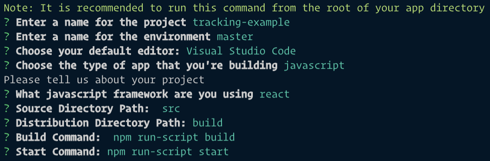
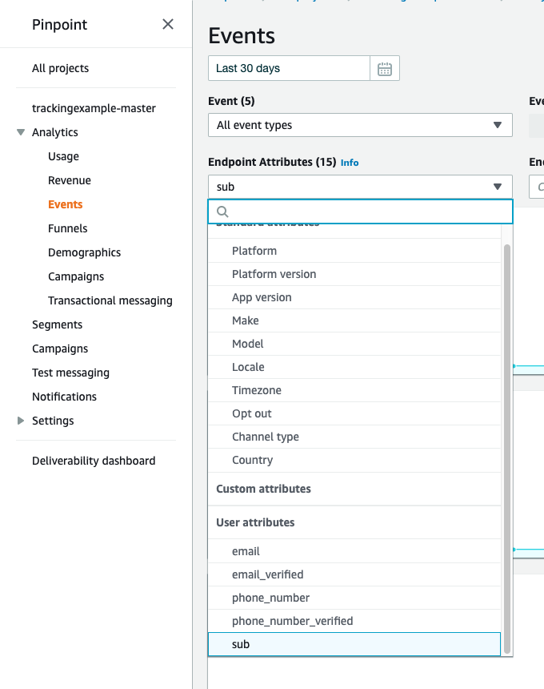
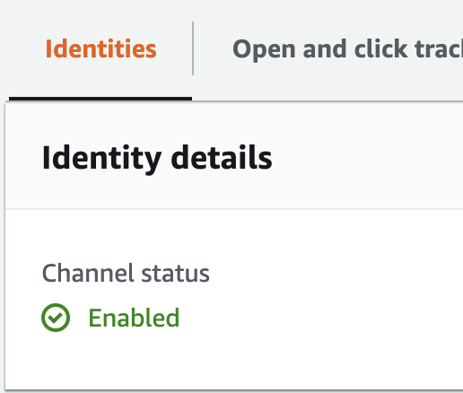

**Track which features your users use** in AWS Amplify and send them emails, push-notifications and SMS based on their behavior.

In this tutorial, you are going to learn how you can use the [analytics category](https://aws-amplify.github.io/docs/js/analytics) from AWS Amplify together with [AWS Pinpoint](https://aws.amazon.com/pinpoint/) to **understand and engage your users.**

---

**Note:** This post is a tutorial for intermediates. Do you want to learn how to accelerate the creation of your projects using Amplify 🚀? For beginners, I recommend checking out [Nader Dabit](https://twitter.com/dabit3)'s [free course on egghead](https://egghead.io/courses/building-serverless-web-applications-with-react-aws-amplify), or Amplify's ['Getting Started'](https://aws-amplify.github.io/docs/js/start) to learn the basics.

If you're running a company, it's essential to [know your metrics](https://a16z.com/2015/08/21/16-metrics/). Let's suppose you have a brand new feature for your website, PWA or mobile app. How do you know that your users are enjoying it? And how do you remind them to keep using your app 🤔?

With AWS Amplify, you can easily track your users' activity. And AWS Pinpoint allows you to send them engaging, customized and relevant messages. With relevant I mean [being right about the **conversation** you have, the **audience** you target and the **place** and **time** you choose to interact](https://youtu.be/epyxK6iCzZY?t=62). Let's learn how to do this in React.

## Set Up

If you want to code along follow the steps here. If not, make sure to at least look at the routing before you skip to "Tracking".

We start by creating a new React app.

```bash
npx create-react-app tracking-example && cd tracking-example
```

Next, install AWS Amplify and React Router.

```bash
yarn add aws-amplify aws-amplify-react react-router-dom
```

Optionally, add your favorite linting packages and PropTypes.

```bash
yarn add --dev prop-types eslint-plugin-simple-import-sort eslint-config-prettier
```

If you did, add `.eslintrc.json`.

```json
{
  "extends": ["react-app", "prettier"],
  "plugins": ["simple-import-sort"],
  "rules": {
    "simple-import-sort/sort": "error",
    "import/order": "off"
  }
}
```

Then in `src/` delete `logo.svg` and `App.css` and change `App.js` to reflect the following.

```js
import React from 'react';

function App() {
  return (
    <div>
      <p>Tracking Example</p>
    </div>
  );
}

export default App;
```

### Initializing Amplify

Run `amplify init` to initialize your project. Answer all the questions with your information.



When asked "Do you want to use an AWS profile?" choose "Yes" if you already have one and pick it. We also need to configure Amplify in `src/index.js`.

```js
import Amplify from 'aws-amplify';
import config from './aws-exports';

Amplify.configure(config);
```

### Auth

We want to distinguish who did what. Therefore we need user profiles. To add authentication, run `amplify add auth`. When asked, choose "Default Configuration" and "Email". Run `amplify push` to upload your changes to the cloud.

Wrap your `<App />` component within `src/App.js` in the `withAuthenticator` HOC.

```js
import { withAuthenticator } from 'aws-amplify-react';
// ...
export default withAuthenticator(App, { includeGreetings: true });
```

Start your React app (`yarn start`) and create an account.

### Routing

Our app is going to have two features, `Todos` and `Notes`. We want to track how often a user uses a given feature. To do that we are going to add three Routes to `src/App.js`, one for `Home` and one for each feature.

```jsx
// ... previous imports
import { BrowserRouter as Router, Link, Route } from 'react-router-dom';

function Home() {
  return <h2>Home</h2>;
}

function Notes() {
  return <h2>Notes</h2>;
}

function Todos() {
  return <h2>Todos</h2>;
}

function App() {
  return (
    <Router>
      <div>
        <nav>
          <ul>
            <li>
              <Link to="/">Home</Link>
            </li>
            <li>
              <Link to="/notes/">Notes</Link>
            </li>
            <li>
              <Link to="/todos/">Todos</Link>
            </li>
          </ul>
        </nav>

        <Route path="/" exact component={Home} />
        <Route path="/notes/" component={Notes} />
        <Route path="/todos/" component={Todos} />
      </div>
    </Router>
  );
}
// ...
```

## Tracking

Now that our app is set up, let's start tracking it 🔥. Add Amplify's analytics to your app.

```bash
amplify add analytics
```

When asked whether unauthenticated users can send events, choose "Yes." Run `amplify push` to update your backend.

AWS Amplify is pretty awesome. **By default, this set up already tracks user sessions and authentication events.** You can view the recorded data in the [AWS Pinpoint console](https://eu-central-1.console.aws.amazon.com/pinpoint/home/#/apps). Note that _sometimes it takes a couple of minutes until you can see the recently registered events._ This can lead to confusion when you try out your own code and want to check whether it tracks events correctly. Make sure to wait at least 5 minutes before you rule out that your code is wrong. Within that time frame, your events can still appear in the console. If they aren't after that much time, then you might have made a mistake.

### Custom Events

Now you can **record custom events** by invoking the `record` method and passing it an event object. If you want to use `Analytics`, you need to import the module manually.

```js
import Analytics from '@aws-amplify/analytics';

Analytics.record({
  name: 'videoView',
  attributes: { content: 'gaming', creator: 'Geromekevin' },
  metrics: { minutesWatched: 14 },
});
```

A [custom event](https://aws-amplify.github.io/docs/js/analytics#recording-custom-events) object must have at least a value for the `name` key. Optionally, it can have an `attributes` and a `metric` key. Both contain another object. With `attributes` you can add additional attributes to the event which must be of type `string` and metrics lets you add keys whose values have to be of type `number`.

### Auto Tracking

We are not going to use custom events. Instead, we let Amplify do the work and use [Auto Tracking](https://aws-amplify.github.io/amplify-js/api/classes/analyticsclass.html#autotrack). **Auto Tracking can track events, page views and sessions.** This tutorial is going to cover page views, but once you get the concept, you will be able to transfer it to any use case.

Using Auto Tracking is pretty straight forward. Simply import `Analytics` and call its `autoTrack` method.

```js
// src/index.js
import Analytics from '@aws-amplify/analytics';
// ...
Analytics.autoTrack('pageView', {
  enable: true,
  type: 'SPA',
});
```

Click around in your app and check your console. Under "Events" you can now see which URL has been visited how often. (Remember to wait a couple of minutes, if you're not seeing anything yet.)

Check out the [page view tracking docs](https://aws-amplify.github.io/docs/js/analytics#page-view-tracking) for all options that you can pass to `autoTrack`. I'm just gonna point out, that just like `record` `autoTrack` also accepts an `attribute` key for custom attributes.

### Endpoints

What we haven't done is recording exactly which user visited the URLs. For that, we need to configure an endpoint. The [endpoint docs](https://docs.aws.amazon.com/pinpoint/latest/developerguide/audience-define-endpoints.html) do a great job of explaining them, so let me quote them.

> **An endpoint represents a destination that you can message**—such as a mobile device, phone number, or email address. Before you can message a member of your audience, you must define one or more endpoints for that individual.

Okay, to message a user, we need to define an endpoint with his email address.

> When you define an endpoint, you specify the channel and address. **The channel is the type of platform** that you use to message the endpoint. Examples of channels include a push notification service, SMS, or email. **The address specifies where to message the endpoint**, such as a device token, phone number, or email address.

Actually, as soon as we started using Analytics, an endpoint was already created for the user. But we do need to update it with the user's data. In other words, we need to give the endpoint a channel and an address. Here is how you do that.

```js
// App.js
import Analytics from '@aws-amplify/analytics';
import Auth from '@aws-amplify/auth';
// ...
const mapObj = f => obj =>
  Object.keys(obj).reduce((acc, key) => ({ ...acc, [key]: f(obj[key]) }), {});
const toArrayOfStrings = value => [`${value}`];
const mapToArrayOfStrings = mapObj(toArrayOfStrings);

async function trackUserId() {
  try {
    const { attributes } = await Auth.currentAuthenticatedUser();
    const userAttributes = mapToArrayOfStrings(attributes);
    Analytics.updateEndpoint({
      // highlight-start
      address: attributes.email,
      channelType: 'EMAIL',
      optOut: 'NONE',
      userId: attributes.sub,
      userAttributes,
      // highlight-end
    });
  } catch (error) {
    console.log(error);
  }
}

function App() {
  useEffect(() => {
    // highlight-start
    trackUserId();
    // highlight-end
  }, []);
  return // ...
```

Let's go over this code.

First, we define some helper methods that let us construct `mapToArrayOfStrings`. This method maps over an object and returns a new object that has all its values replaced with arrays of strings of these values.

We define a method called `trackUserId` in which we get the current user. Since we wrapped `App` in the `withAuthenticator` HOC, `Auth.currentAuthenticatedUser()` always returns a user, which we destructure for its attributes.

According to [the docs for the `updateEndpoint` method](https://aws-amplify.github.io/docs/js/analytics#update-endpoint) - which you should check out to learn its full capabilities - the key `userAttributes` expects arrays of strings as its values, which is why we use `mapObj(toArrayOfStrings)` in the next line.

We invoke `updateEndpoint`, passing the user's email as the `address` with the respective channel of `'EMAIL'`, the `userId` and the previously created `userAttributes`. `optOut: 'NONE'` means that the user will receive all messages that you send him. You need to set this because Amplify by default opts out of all messages (`'ALL'`).

Lastly, we call `trackUserId` in a `useEffect` Hook. It needs no dependencies because we defined `trackUserId` outside of `<App />`. Therefore it only runs once when `<App />` is rendered for the first time.

Navigate through the routes of your app and then check your Pinpoint console. You should now be able to filter by user attributes.



## Email Reminders

We collected when which user visits which URL. Let's start engaging them based on their feature usage by sending them emails.

### Email Set Up

To send emails using Pinpoint, we need to [verify an email address](https://docs.aws.amazon.com/pinpoint/latest/userguide/channels-email-manage-verify.html#channels-email-manage-verify-email-address). (Alternatively, you can [verify an entire domain](https://docs.aws.amazon.com/pinpoint/latest/userguide/channels-email-manage-verify.html#channels-email-manage-verify-domain).) In your Pinpoint console click on "Settings > Email > Identities > Edit". Check the "Enable the email channel for this project" box and enter your email address in the input below. Afterwards, click on verify and click the link in the email that was sent to you. The last step is to hit save. Now the email channel should be enabled for you.



### Creating a Segment

Next, we need to create a segment. To do that, click on "Segments". Give your segment a name. I'm gonna call mine "Daily Active Users". Then add a filter for the "EMAIL" channel and click "Create segment".

**Note:** If you get a red error message that says "No matches found", make sure you have `optOut: 'NONE'` in your `updateEndpoints` message and that you waited several minutes for the events to became available in the console.

### Creating a Campaign

Click on "Campaign" in the Pinpoint console and click "Create a campaign". I'll call mine "Daily Gratefulness". Pick "Standard campaign" and click "Next". On the next screen, choose the segment that you created previously and click "Next". Write your message in the "Message" text area. Here is mine.

```html
<!DOCTYPE html>
<html lang="en">
  <head>
    <meta http-equiv="Content-Type" content="text/html; charset=utf-8" />
  </head>
  <body>
    <h2>{{Attributes.userName}}</h2>
    <p>Thank you for using the todos feature today.</p>
  </body>
</html>
```

You can use [Message Variables](https://docs.aws.amazon.com/pinpoint/latest/userguide/campaigns-message.html#campaigns-message-variables) to customize the message to your user.

My email subject is "Thank You 🙏🏻".

On the next screen, you can configure when you want to send the email. I want to thank my user for using the `Todos` feature, so I check "When an event occurs", choose "pageView" as my event and select "localhost:3000/todos/" as my attribute. As a start time I choose today with my current time plus 30 minutes because the start date has to be at least 15 minutes from now and as an end time I choose tomorrow.

Click on "Launch campaign" on the next screen.

That's it 👏🏻. Now, wait until your campaign starts and trigger the event, so you get the email.

If you prefer to do [Push Notifications](https://docs.aws.amazon.com/pinpoint/latest/userguide/channels-mobile.html) or [SMS](https://docs.aws.amazon.com/pinpoint/latest/userguide/channels-sms.html), you should now be able to figure out how to set those up in your Pinpoint console, too.

## Tearing Everything Down

Since this was only a tutorial, you can get rid of the instances created in the cloud by running `amplify delete`. After that command finished, revisit the Pinpoint console and click "Delete Project" under "Settings > General Settings".

## Summary

We used AWS Amplify to track user behavior and respond dynamically to it by sending emails.
