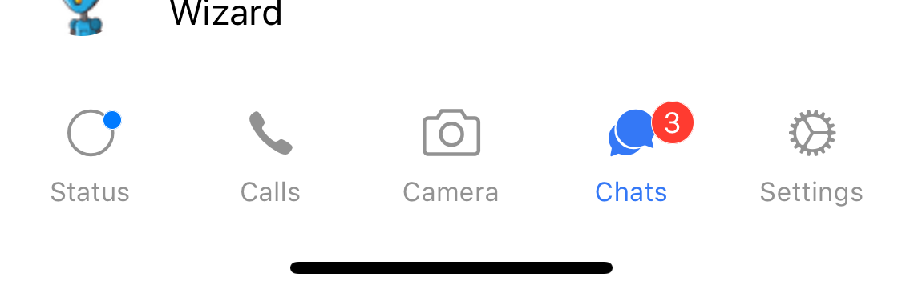

You are going to **learn how to build a HOC for React using TypeScript.** We are going to develop a Higher-Order Component that adds a badge to other components. We are also going to **use them as decorators.** Even though the example is for React Native, the same principles apply for all React HOCs in general.

---

**Note:** This post is targeted at intermediates and a follow up of my beginner-friendly post ["How To Add a Badge to Icons in React Native"](https://geromekevin.com/how-to-add-a-badge-to-icons-in-react-native), where you can learn about HOCs in regular JavaScript.

---

When I created my first [Higher-Order Component](https://reactjs.org/docs/higher-order-components.html) in TypeScript, I had to learn **how to type it correctly**, and I spend much time googling. In this tutorial, you will learn how to build HOCs in TypeScript, so that you can cut your learning curve. At the end of this post, you are going to see how to use them as a decorator.

### 1. The Example

As an example, I'm going to use an icon in a tab bar. If you want to see other use cases, check out [my previous article](https://geromekevin.com/how-to-add-a-badge-to-icons-in-react-native).

The end result is going to look like this 😍:



**Note:** If you only want to **see the code for the HOC skip to section 3**. For the usage of decorators, check out part 4. Otherwise, code along and join me by ...

### 2. Setting Up the App

First, we need to create an app with TypeScript. Follow the instructions [here](https://geromekevin.com/using-typescript-with-react-native)¹, but leave out the testing setup.

We need to add three packages: React Navigation (V2)², React Native Elements (preferably V1, but since it's not out as of the writing of this post, we will use the next branch), and React Native Vector Icons. Remember to link the icons.

```bash
npm install --save react-navigation@2.18.2 https://github.com/react-native-training/react-native-elements.git\#next react-native-vector-icons && react-native link
```

Add the types for React Navigation.

```bash
npm install --save-dev @types/react-navigation
```

Create a folder called `app/`. Move `App.tsx` into it and adjust the import in `index.js`.

Within `app/` create the folders `components/`, `navigation/` and `screens/`.

Create five files one for each tab ("Status", "Calls", "Camera", "Chats" and "Settings") in the `screens/` directory. They should all look something like this:

```tsx
import React, { Component } from 'react';
import { StyleSheet, Text } from 'react-native';
import { SafeAreaView } from 'react-navigation';

export class Calls extends Component {
  public static navigationOptions = {
    title: 'Calls',
  };

  public render() {
    return (
      <SafeAreaView style={styles.container}>
        <Text>This screen is Calls.</Text>
      </SafeAreaView>
    );
  }
}

const styles = StyleSheet.create({
  container: {
    alignItems: 'center',
    flex: 1,
    justifyContent: 'center',
  },
});

export default Calls;
```

Afterwards, create a `index.ts` file to manage the `screen/` directory's exports.

```ts
import Calls from './Calls';
import Camera from './Camera';
import Chats from './Chats';
import Settings from './Settings';
import Status from './Status';

export { Calls, Camera, Chats, Settings, Status };
```

Subsequently, we are going to create the routing for our app in `navigation/navigation.tsx`.

```tsx
import React from 'react';
import { Platform } from 'react-native';
import { Icon } from 'react-native-elements';
import {
  createBottomTabNavigator,
  createStackNavigator,
  TabScene,
} from 'react-navigation';
import withBadge from '../components/withBadge';
import { Calls, Camera, Chats, Settings, Status } from '../screens';

const stackConfig = {
  cardStyle: { backgroundColor: 'white' },
};

const StatusStack = createStackNavigator({ Status }, { ...stackConfig });
StatusStack.navigationOptions = {
  tabBarIcon: ({ tintColor }: TabScene) => {
    const BadgedIcon = withBadge(undefined, { status: 'primary' })(Icon);
    return (
      <BadgedIcon
        name={`${Platform.OS === 'ios' ? 'ios' : 'md'}-radio-button-off`}
        type="ionicon"
        color={tintColor}
      />
    );
  },
  tabBarLabel: 'Status',
};

const CallsStack = createStackNavigator({ Calls }, { ...stackConfig });
CallsStack.navigationOptions = {
  tabBarIcon: ({ tintColor }: TabScene) => (
    <Icon
      name={`${Platform.OS === 'ios' ? 'ios' : 'md'}-call`}
      type="ionicon"
      color={tintColor}
    />
  ),
  tabBarLabel: 'Calls',
};

const CameraStack = createStackNavigator({ Camera }, { ...stackConfig });
CameraStack.navigationOptions = {
  tabBarIcon: ({ tintColor }: TabScene) => (
    <Icon name="camera" type="simple-line-icon" color={tintColor} />
  ),
  tabBarLabel: 'Camera',
};

const ChatsStack = createStackNavigator({ Chats }, { ...stackConfig });
ChatsStack.navigationOptions = {
  tabBarIcon: ({ tintColor }: TabScene) => {
    const BadgedIcon = withBadge(3)(Icon);
    return (
      <BadgedIcon
        name={`${Platform.OS === 'ios' ? 'ios' : 'md'}-chatbubbles`}
        type="ionicon"
        color={tintColor}
      />
    );
  },
  tabBarLabel: 'Chats',
};

const SettingsStack = createStackNavigator(
  { Settings },
  { ...stackConfig }
);
SettingsStack.navigationOptions = {
  tabBarIcon: ({ tintColor }: TabScene) => (
    <Icon
      name={`${Platform.OS === 'ios' ? 'ios' : 'md'}-cog`}
      type="ionicon"
      color={tintColor}
    />
  ),
  tabBarLabel: 'Settings',
};

const RootTabs = createBottomTabNavigator(
  { StatusStack, CallsStack, CameraStack, ChatsStack, SettingsStack },
  { initialRouteName: 'ChatsStack' }
);

export default RootTabs;
```

Before our example app is ready, we need to use the navigator in `App.tsx`.

```tsx
import React, { Component } from 'react';
import { Platform } from 'react-native';
import { colors, ThemeProvider } from 'react-native-elements';
import Navigator from './navigation/navigation';

export default class App extends Component {
  public render() {
    return (
      <ThemeProvider theme={theme}>
        <Navigator />
      </ThemeProvider>
    );
  }
}

const theme = {
  colors: {
    ...Platform.select({
      default: colors.platform.android,
      ios: colors.platform.ios,
    }),
  },
};
```

Notice how we gave our app the respective native platform's colors for flavor.

Now our app is crashing, because we already used an imported the HOC in `navigation.tsx` 💥. (Relax, I'll address the usage below.) Let's fix this by ...

### 3. Building the Higher-Order Component

Now we get to the meat. Have a look at the code first, then we are going to go through it together. Create a file called `withBadge.tsx` inside the `components/` folder.

```tsx
import React, { Component, ComponentType, ReactNode } from 'react';
import { StyleSheet, View } from 'react-native';
import { Badge, BadgeProps } from 'react-native-elements';

interface WithBadgeProps {
  bottom?: number;
  left?: number;
  right?: number;
  top?: number;
  hidden?: boolean;
}

function withBadge(
  value?: ReactNode,
  options: WithBadgeProps & BadgeProps = {}
): <P extends object>(
  WrappedComponent: ComponentType<P>
) => ComponentType<P> {
  return <P extends object>(WrappedComponent: ComponentType<P>) =>
    class BadgedComponent extends Component<P> {
      public render() {
        const { bottom, hidden = false, left, ...badgeProps } = options;
        let { right = -16, top = -1 } = options;
        if (!value) {
          (right = -3), (top = 3);
        }
        return (
          <View style={styles.container}>
            <WrappedComponent {...this.props} />
            {!hidden && (
              <Badge
                value={value}
                status="error"
                containerStyle={StyleSheet.flatten([
                  styles.badgeContainer,
                  { bottom, left, right, top },
                ])}
                {...badgeProps}
              />
            )}
          </View>
        );
      }
    };
}

const styles = StyleSheet.create({
  badgeContainer: {
    position: 'absolute',
  },
  container: {
    alignItems: 'center',
    justifyContent: 'center',
    position: 'relative',
  },
});

export default withBadge;
```

We first import the types and components that we need. Next, we are defining an interface for the props of the `withBadge` HOC.

Then we define the HOC. We want to be able to use the HOC with a minimal syntax like this:

```tsx
withBadge()(ComponentToBeBadged); // MiniBadge
withBadge(2)(ComponentToBeBadged); // Regular Badge with value 2
```

This is the standard syntax for HOCs. First, give the injected parameters and then the component.

Therefore the first parameter for our HOC has to be the `value` parameter that models React Native Elements `value` in the `BadgeProps`. If you incorrectly used the beta version of RNE, this will throw an error, because only since the actual version one `value` can be of type `ReactNode`. We made this parameter optional so that we can also use it for `MiniBadge`s.

The second parameter of the HOC is just an object called `options`. Its type is a conjunction of our `WithBadgeProps` and the `BadgeProps` types. The reason for this we will see below. We give it an empty object as it's default value.

Consequently, we define the `WrappedComponent` as the return value of the HOC's first function. Since it is a component, it is of course of type `ComponentType`. We use [generics](https://www.typescriptlang.org/docs/handbook/generics.html) and [`extends`](https://www.typescriptlang.org/docs/handbook/interfaces.html) to declare an object as the `WrappedComponent`s props' default. (**Note:** For decorators, we have to change that - see section four.)

Lastly, we return a regular React class and pass the component the `P` generic, so that type checking works correctly. The rest is just React code that takes care of proper styling and props passing.

The writing and typing of decorators are as easy as that. It takes a little time to get it right, but if you've done it once it's easy to repeat 😊.

If you are into bleeding edge syntax, you might also want to learn how to use ...

### 4. Decorators

[Decorators](https://github.com/tc39/proposal-decorators) are a proposal for JavaScript that we might get in the coming years 🎖. Other programming languages already have them.

To use decorators, we have to make small changes to our typescript processing and the typing of our component.

Start by installing the babel plugin for decorators.

```bash
npm install --save-dev @babel/plugin-proposal-decorators
```

We need to tell babel to use the plugin by adding a `plugins` key to our `.babelrc` file.

```json
"plugins": [["@babel/plugin-proposal-decorators", { "legacy": true }]]
```

Additionally, we have to activate decorators in our `tsconfig.json` to get our linter to be okay with us using them.

```json
"experimentalDecorators": true // add this to the 'compilerOptions' object
```

That's it for the configuration.

We still have to make some changes to our HOC's typing. Decorators are internally typed like this:

```ts
declare type ClassDecorator = <TFunction extends Function>(
  target: TFunction
) => TFunction | void;
```

Therefore we can't use a return type of `ComponentType`. Otherwise, your linter will yell and your compiler, depending on your settings, might not compile. To compensate for this, change the return type of your first arrow function to `void`.

```ts
): <P extends object>(WrappedComponent: ComponentType<P>) => void {
```

Now you can use the decorator like this³:

```tsx
import React, { Component } from 'react';
import { Icon } from 'react-native-elements';
import { connect } from 'redux';
import withBadge from './withBadge';

@connect(state => ({ notifications: state.notifications }))
@withBadge(props => props.notifications.length)
export default class BadgedComponent extends Component {
  public render() {
    return <Component {...props} />;
  }
}
```

Enjoy your experimental features 🚀.

### Footnotes

1. If you like the guide to create a TypeScript app that I linked, please up-vote [this PR](https://github.com/facebook/react-native-website/pull/705), because you can help to get it posted on React Native PR. It will make following the steps to create a new RN app with TypeScript a easy.
2. As of writing of this post version three does not have types, yet.
3. If you use `void` as a return type you can't use it in the classic way. The API is just broken right now, since it's still and experimental feature. If I'm wrong with this assumption, please react out to me on [Twitter](https://twitter.com/geromekevin) and correct me.
